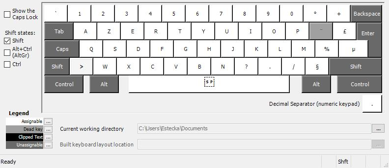
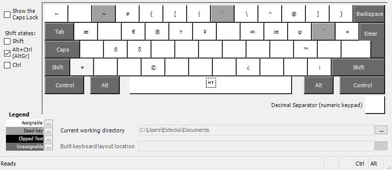
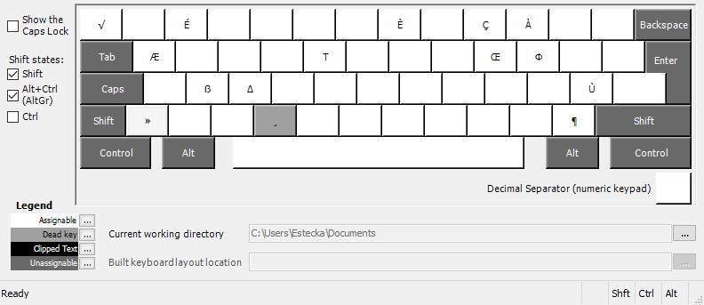

# French Azerty Extended

Built upon the native French azerty layout, but with extra key combinations where the former left some blanks. This allows for easier typing of several punctuations, accentuated  and special characters.

## Added functionalities

### Accents
The `^¨` dead-key now also lets type Accute accents and Grave accents. A Cedilla dead key was put on `C`. Mostly useful for upper case characters that aren't natively present on the keyboard.

|      Key Combination | Accent  | Description |
| --------------------:|:-------:|:----------- |
|         AltGr + `^¨` | `´`     | Accute accent |
| AltGr + Shift + `^¨` | `` ` `` | Grave accent  |
|  AltGr + Shift + `C` | `¸`     | Cedilla       |

### Latin characters

|         Key Combination | Result  | Description  |
| -----------------------:|:-------:|:------------ |
|   AltGr + Shift + `2é~` | `É` | Upper E-accute    |
|   AltGr + Shift + `` 7è` `` | `È` | Upper E-grave    |
|   AltGr + Shift + `9ç^` | `Ç` | Upper C-cedilla  |
|   AltGr + Shift + `0à@` | `À` | Upper A-grave    |
|   AltGr + Shift + `%ù`  | `Ù` | Upper U-grave    |
|             AltGr + `O` | `œ` | Lower E-dans-l'O |
|     Shift + AltGr + `O` | `Œ` | Upper E-dans-l'O |
|             AltGr + `A` | `æ` | Lower Ash        |
|     Shift + AltGr + `A` | `Æ` | Upper Ash        |
|             AltGr + `S` | `ß` | Lower Eszett     |
|     Shift + AltGr + `S` | `ẞ` | Upper Eszett     |

### Punctuation

|         Key Combination | Result  | Description |
| -----------------------:|:-------:|:----------- |
|             Shift + `²` | `` ` `` | Back-quote / backtick  |
|             AltGr + `²` | `~` | Tilde |
|       AltGr + `[space]` | `	` | Tabulation  _Unlike the tab key, this will not select the next field on a page, and thus may force a tabulation to be typed where it would normally need to be copy-pasted._ |
| Shift + AltGr + `[space]` | ` ` | Non-breaking space, a.k.a. `&nbsp;` |
|              AltGr + `><` | `«` | Left guillemet      |
|      Shift + AltGr + `><` | `»` | Right guillemet     |
|              AltGr + `?,` | `¿` | Inverted question mark    |
|              AltGr + `§!` | `¡` | Inverted exclamation mark |
|      Shift + AltGr + `§!` | `¶` | Pilcrow |

### Miscellaneous special characters

|         Key Combination | Result  | Description |
| -----------------------:|:-------:|:----------- |
|       AltGr + Shift + `²` | `√` | Square Root          |
|               AltGr + `I` | `∞` | Infinity             |
|               AltGr + `C` | `©` | Copyright            |
|               AltGr + `M` | `™` | Trademark            |
|               AltGr + `R` | `®` | Registered Trademark |
|               AltGr + `Y` | `¥` | Yen                  |

### Miscellaneous Greek characters

A handful of greek characters, not all of them. Added for the sake of it.

|         Key Combination | Result | Description |
| -----------------------:|:------:|:----------- |
|             AltGr + `D` | `δ`    | Lower Delta |
|     Shift + AltGr + `D` | `Δ`    | Upper Delta |
|             AltGr + `P` | `φ`    | Lower Phi   |
|     Shift + AltGr + `P` | `Φ`    | Upper Phi   |
|             AltGr + `T` | `τ`    | Lower Tau   |
|     Shift + AltGr + `T` | `Τ`    | Upper Tau   |

## Key map

### Default

### Shift

### AltGr

### AltGr + Shift

